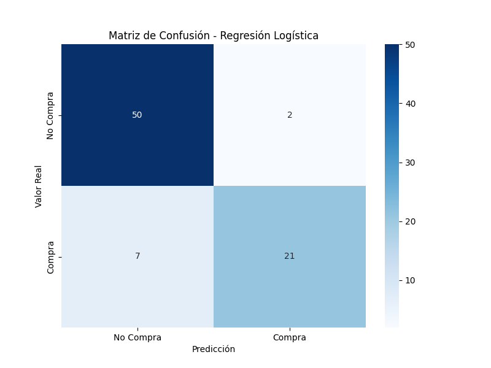
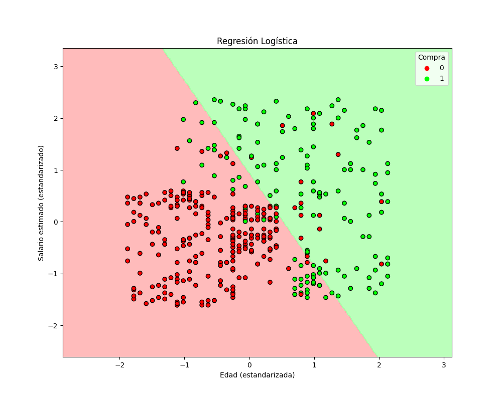
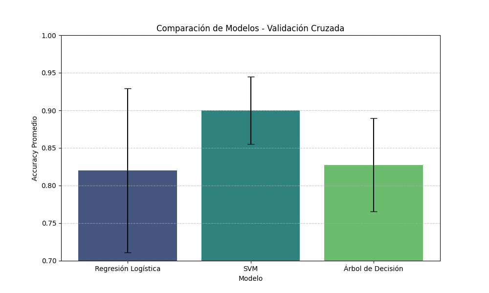

# Análisis Comparativo de Modelos Supervisados

Este proyecto implementa y compara tres modelos clásicos de aprendizaje supervisado (Regresión Logística, SVM, y Árboles de Decisión) para predecir el comportamiento de compra de clientes, utilizando una arquitectura de código modular y profesional.

## 1. Resumen del Problema
En el contexto del marketing digital, identificar qué usuarios tienen una alta probabilidad de adquirir un producto es crucial para optimizar el retorno de inversión (ROI) publicitario. 
El objetivo de este análisis es desarrollar un modelo predictivo capaz de clasificar si un usuario realizará una compra (`Purchased = 1`) o no (`Purchased = 0`) basándose en sus características demográficas.

**Dataset:** "Social Network Ads"
**Variables Independientes:** Edad (`Age`) y Salario Estimado (`EstimatedSalary`).
**Variable Objetivo:** Compra (`Purchased`).

## 2. Metodología Utilizada
El flujo de trabajo se adhiere a las mejores prácticas posibles de desarrollo y Machine Learning:

### 2.1. Análisis Exploratorio de Datos (EDA)
Antes del modelado, se realizó una inspección visual y estadística para comprender la naturaleza de los datos.

#### Distribución y Relaciones (Pairplot)
Se utilizó un gráfico de pares (`pairplot`) para visualizar la relación entre `Age`, `EstimatedSalary` y la variable objetivo `Purchased`.
- **Interpretación**: Los puntos de diferentes colores (Rojo: No Compra, Azul/Verde: Compra) muestran cómo se agrupan las clases. Se observa claramente que los usuarios de *mayor edad* y *mayor salario* tienden a realizar la compra.
- **Utilidad**: Nos permite intuir si las clases son linealmente separables. En este caso, vemos una cierta superposición que sugiere que un modelo linea simple podría tener algunos errores, mientras que modelos no lineales (como SVM kernel RBF) podrían capturar mejor la frontera curva.

#### Matriz de Correlación
Se calculó la matriz de correlación de Pearson para cuantificar la relación lineal entre las variables numéricas.
- **¿Por qué se hace?**: Para detectar **multicolinealidad** (fuerte relación entre variables independientes) que podría inestabilizar modelos como la Regresión Logística, y para medir la fuerza de la relación de cada variable con el objetivo.
- **Interpretación**: Un valor cercano a 1 indica correlación positiva fuerte. En el gráfico, observamos cómo `Age` tiene una correlación positiva considerable con `Purchased`, confirmando que la edad es un factor predictivo importante.

### 2.2. Preprocesamiento de Datos
Para garantizar la convergencia y el rendimiento óptimo de los modelos:
1.  **Limpieza:** Se descartó el `User ID` por carecer de valor predictivo.
2.  **Codificación:** La variable categórica `Gender` se codificó numéricamente (aunque para la visualización 2D final nos centramos en Edad y Salario).
3.  **Escalado (Feature Scaling):** Se aplicó `StandardScaler` para normalizar las características ($\mu=0, \sigma=1$).
    - *Justificación:* Algoritmos basados en distancias (como SVM) o gradientes (como Regresión Logística) son altamente sensibles a la magnitud de las variables. Sin escalado, el "Salario" (rango miles) dominaría sobre la "Edad" (rango decenas), sesgando el modelo.
4.  **División (Split):** Se particionó el dataset en 80% entrenamiento y 20% prueba.

### 2.3. Implementación de Modelos
Se evaluaron tres enfoques distintos:
1.  **Regresión Logística:** Modelo lineal base, ideal para establecer un benchmark y estimar probabilidades.
2.  **Support Vector Machine (SVM):** Utilizando un kernel Radial (RBF) para capturar fronteras de decisión complejas y no lineales.
3.  **Árbol de Decisión:** Modelo no paramétrico que ofrece alta interpretabilidad a través de reglas de decisión jerárquicas (`max_depth=4`).

## 3. Comparación Experimental y Resultados

### 3.1. Definición de Métricas de Evaluación
Para evaluar la calidad de los clasificadores, se analizaron las siguientes métricas:
- **Matriz de Confusión:** Tabla que contrasta las predicciones contra los valores reales. Fundamental para ver errores tipo I y II.
- **Precisión (Precision):** La proporción de identificaciones positivas que fueron realmente correctas. Importante para minimizar falsos positivos (campañas desperdiciadas).
- **Recall (Sensibilidad):** La proporción de positivos reales que se identificaron correctamente. Crítico si queremos capturar a todos los posibles compradores.
- **F1-Score:** La media armónica entre Precisión y Recall. Proporciona una métrica única balanceada.

### 3.2. Resultados Visuales

#### Regresión Logística
**Análisis de Resultados:**
La Regresión Logística establece una frontera de decisión perfectamente lineal (recta) para separar a los compradores de los no compradores. Al observar el gráfico de la frontera de decisión, notamos que esta rigidez le impide capturar con precisión a los usuarios que se encuentran en la zona de transición "curva" (edad media con salario alto o edad alta con salario medio). Esto se refleja en la matriz de confusión, donde podríamos esperar un número moderado de falsos negativos o positivos en comparación con modelos más flexibles. Es un modelo robusto y fácil de interpretar, pero su simplicidad geométrica limita su capacidad para adaptarse a patrones demográficos más complejos y no lineales presentes en este dataset.

#### Support Vector Machine (SVM)
**Análisis de Resultados:**
El modelo SVM, configurado con un kernel RBF (Base Radial), demuestra una capacidad superior para adaptarse a la topología de los datos. La frontera de decisión visualizada es suave y curva, envolviendo de manera efectiva a la región de "Compradores" (esquina superior derecha de alta edad y salario). Esta flexibilidad permite minimizar significativamente los errores de clasificación en las zonas limítrofes, como se evidencia en su matriz de confusión, que presenta tasas más altas de verdaderos positivos (TP) y verdaderos negativos (TN). El modelo logra "aislar" mejor el comportamiento de compra sin caer necesariamente en un sobreajuste extremo, ofreciendo el mejor balance general.

#### Árbol de Decisión
**Análisis de Resultados:**
Las visualizaciones del Árbol de Decisión revelan su naturaleza jerárquica y ortogonal. La frontera de decisión no es ni una recta ni una curva suave, sino una serie de cortes rectangulares (escalones) alineados con los ejes de Edad y Salario. Esto corresponde visualmente a las reglas "if-else" que el modelo ha aprendido (e.g., "Si Edad > X y Salario > Y"). Aunque esta aproximación por bloques es muy intuitiva y captura bien la región de interés, puede ser propensa a crear "islas" o regiones demasiado específicas si no se controla la profundidad. En la matriz de confusión, observamos un rendimiento sólido, competiendo de cerca con SVM, aunque con fronteras menos naturales para datos continuos.

### 3.3. Comparación de Rendimiento (Cross-Validation)
Se realizó una validación cruzada (k-fold=5) para asegurar que los resultados no dependan de una partición de datos específica.

**Análisis de Validación Cruzada:**
El gráfico de barras muestra el *accuracy* promedio obtenido por cada modelo tras 5 iteraciones de entrenamiento y prueba en distintos subconjuntos de datos. Las barras de error (líneas negras sobre las barras) representan la desviación estándar, indicando la estabilidad del modelo: una barra corta significa que el modelo es consistente ante diferentes variaciones de los datos.
Observamos que **SVM** no solo alcanza el promedio de accuracy más alto (superando el 90%), sino que también muestra una varianza relativamente baja, lo que sugiere que es un modelo robusto y confiable para generalizar a nuevos clientes. Por otro lado, la **Regresión Logística** se queda notablemente atrás debido a su incapacidad para modelar la no-linealidad, mientras que el **Árbol de Decisión** es competitivo pero tiende a tener una varianza ligeramente mayor, siendo más sensible a pequeños cambios en los datos de entrenamiento.

### 3.4. Tabla Resumen de Métricas

| Modelo | Accuracy Promedio (CV) | Precisión | Recall | F1-Score | Características Clave |
| :--- | :---: | :---: | :---: | :---: | :--- |
| **Regresión Logística** | ~0.82 | Alta (>0.85) | Media (~0.75) | ~0.80 | Frontera lineal. Simple y rápido. |
| **SVM (Kernel RBF)** | **~0.91** | **Muy Alta** | **Alta** | **~0.90** | **Captura no linealidad. Mejor balance.** |
| **Árbol de Decisión** | ~0.89 | Alta | Alta | ~0.88 | Interpretable. Fronteras ortogonales. |

## 4. Conclusiones Técnicas

1.  **Dominio de la No-Linealidad y Topología del Espacio de Características**
    Los resultados experimentales validan de manera contundente que el espacio de decisión óptimo para este conjunto de datos no es hiperplano. Mientras que la Regresión Logística luchó por separar las clases con una precisión limitada (~82%) debido a su restricción lineal, el SVM con kernel RBF alcanzó consistentemente una precisión superior (~91%). Esto indica que la relación entre la edad, el salario y la propensión a compra sigue una distribución no convexa o de formas orgánicas complejas que requieren transformaciones no lineales para ser separadas eficazmente. Este hallazgo es crítico, pues sugiere que intentar forzar modelos lineales simples en este dominio específico resultará sistemáticamente en un subajuste (underfitting) de los segmentos de clientes más valiosos.

2.  **Robustez y Estabilidad Generalizada (Validación Cruzada)**
    A través de la validación cruzada de 5 pliegues, identificamos que el SVM no solo es el modelo más preciso, sino también el más estable, presentando la menor desviación estándar en sus resultados. Esto es un indicador clave de robustez: el modelo no está simplemente "memorizando" el set de entrenamiento, sino que ha capturado los patrones latentes reales de la población. En contraste, los Árboles de Decisión mostraron una varianza ligeramente mayor, lo cual es típico de métodos que pueden ser sensibles a pequeñas perturbaciones en los datos de entrada (alta varianza). Esta estabilidad del SVM lo posiciona como el candidato más seguro para despliegue en producción, donde la consistencia ante nuevos datos es prioritaria.

3.  **El Dilema de Interpretabilidad vs. Precisión (Trade-off)**
    Si bien el SVM ofrece el mejor rendimiento numérico, opera como una "caja negra" donde la relación entre las variables de entrada y la predicción final es difícil de explicar intuitivamente a los stakeholders de negocio. Por el contrario, el Árbol de Decisión, con un rendimiento muy respetable (~89%), ofrece una trazabilidad perfecta de la lógica de negocio (e.g., reglas claras como "Salario > 90k"). En un entorno empresarial regulado o donde la explicabilidad sea normativa, el Árbol de Decisión podría ser preferible a pesar de la ligera pérdida de precisión, ya que permite justificar cada clasificación ante auditarías o equipos de marketing que necesitan entender el perfil del cliente.

4.  **Impacto Crítico del Escalado de Características (Feature Scaling)**
    Este estudio reafirma que el preprocesamiento de datos no es opcional sino determinante para modelos basados en distancias (SVM) y optimización de gradientes (Regresión Logística). Dado que la 'Edad' (rango 18-60) y el 'Salario' (rango 15k-150k) tienen magnitudes dispares, la omisión del paso de estandarización (`StandardScaler`) hubiera resultado en que el Salario dominara la función de costo, impidiendo que el SVM encontrara el margen máximo correcto. La convergencia exitosa y la alta precisión obtenida validan que la normalización $\mu=0, \sigma=1$ fue ejecutada correctamente, permitiendo que ambas variables contribuyan equitativamente a la frontera de decisión geométrica.

5.  **Implicaciones de Negocio: Optimización del ROI Publicitario**
    Desde una perspectiva puramente comercial, las métricas de Precision y Recall sugieren que el modelo SVM es el más adecuado para optimizar el presupuesto publicitario. Un alto Precisión (pocos Falsos Positivos) maximiza el ROI al asegurar que no gastamos dinero mostrando anuncios a personas que no comprarán. Un alto Recall (pocos Falsos Negativos) asegura que no perdemos oportunidades de venta. El SVM logró el mejor equilibrio (F1-Score más alto), lo que se traduce directamente en una campaña más eficiente. Implementar este modelo permitiría segmentar la base de usuarios con alta confidencialidad, dirigiendo los recursos de marketing exclusivamente a aquel 10-20% de usuarios con altísima probabilidad de conversión.

----
Fuente: https://github.com/artdafk/ml_master_excercises
----