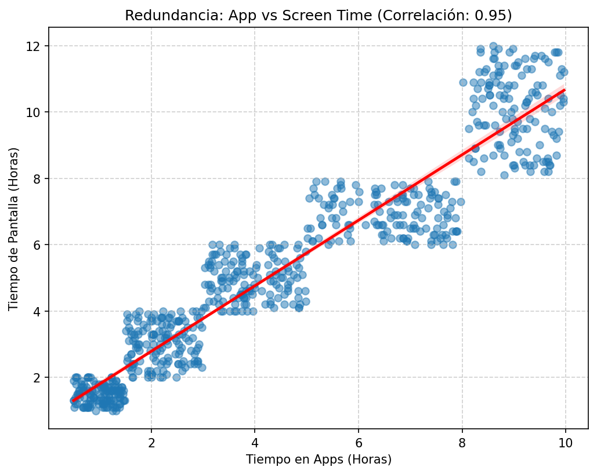
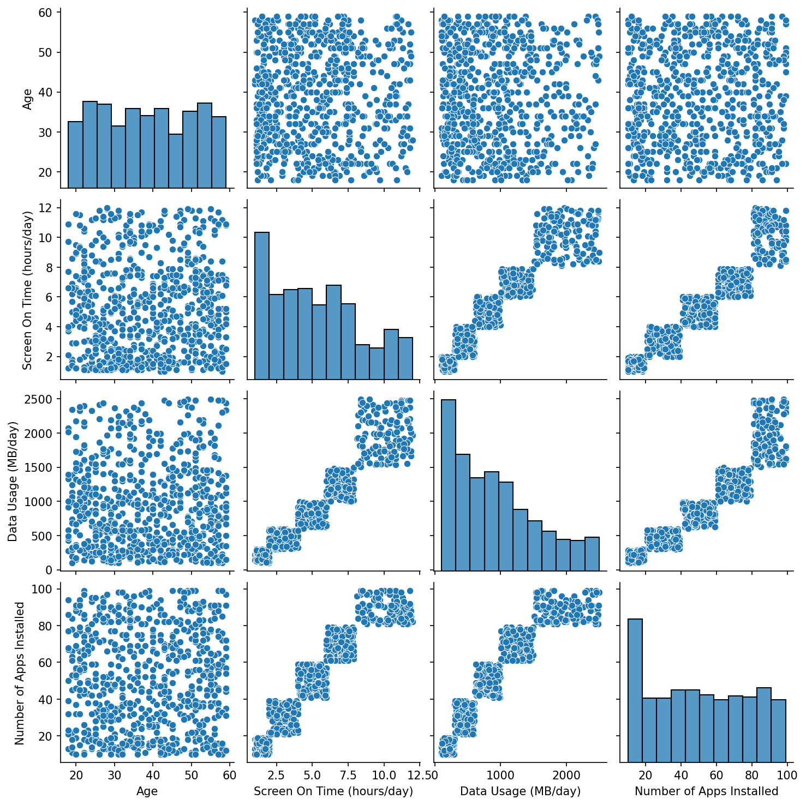
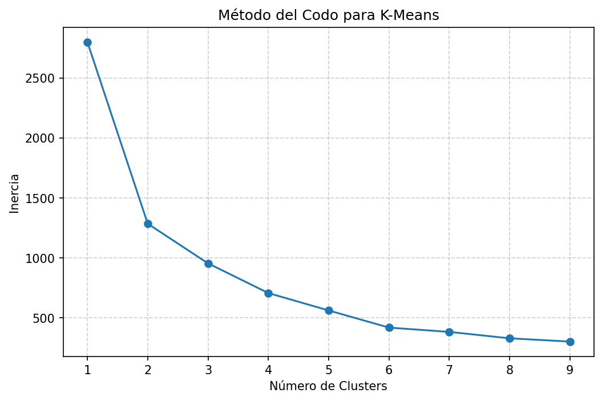
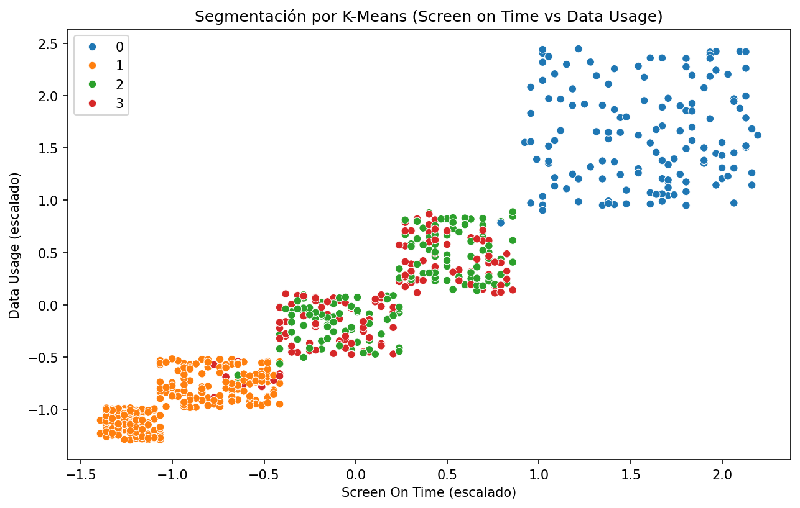
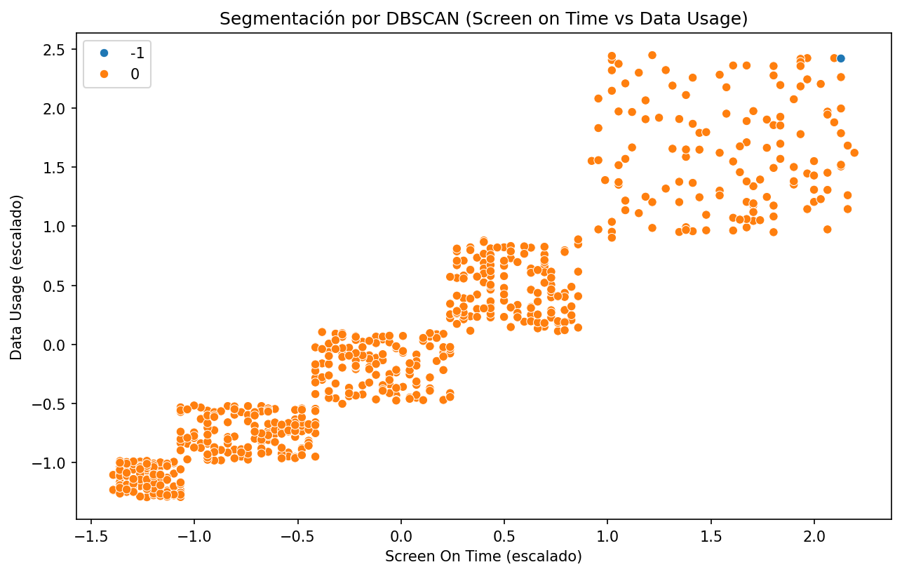
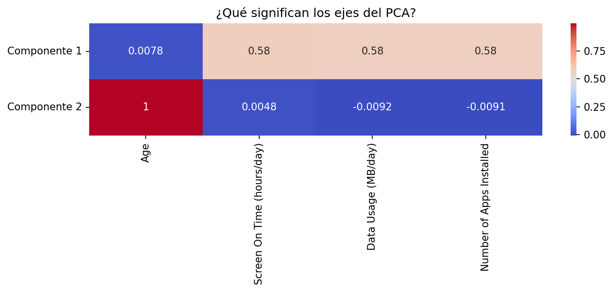
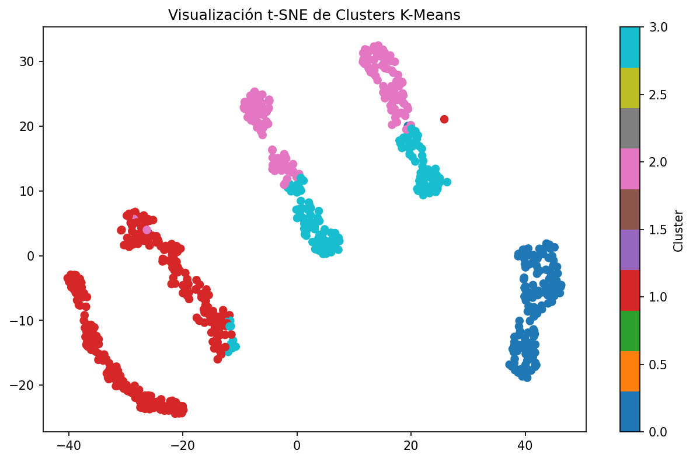

# 1. Resumen: Segmentación Estratégica de Usuarios Móviles
**Fecha:** 07 de Febrero, 2026
**Autor:** Jefferson Velasquez
**Asunto:** Definición de Arquetipos de Comportamiento Digital (Clustering Analysis)

---

## 1. Visión General
El presente análisis utiliza algoritmos de Machine Learning no supervisado (**K-Means, DBSCAN**) validados mediante reducción de dimensionalidad (**PCA** y **t-SNE**) para segmentar la base de usuarios móviles.

**Hallazgo Principal:**
Hemos identificado **4 Tribus Digitales** distintas. El análisis demuestra concluyentemente que la **Edad cronológica no determina la intensidad de uso**. Existen usuarios "maduros" con alto consumo digital y usuarios "jóvenes" con patrones minimalistas. La estrategia comercial debe transicionar de una segmentación demográfica a una **comportamental**.

---

## 2. Matriz de Segmentos (Snapshot)

| Cluster | Arquetipo ("Persona") | Categoría de Negocio   | Rasgo Distintivo | Oportunidad |
|:--------| :--- |:-----------------------| :--- | :--- |
| **0**   | **Los Digital Omnivores** | **VIP / Alto Valor**   | Consumo extremo (10h+ pantalla). | Upselling Premium. |
| **1**   | **Los Minimalistas** | **Riesgo / Low Cost**  | Uso estrictamente funcional. | Retención (Anti-Churn). |
| **2**   | **Silver Surfers Activos** | **Core / Estabilidad** | Adultos (49+) muy digitalizados. | Lealtad y Seguridad. |
| **3**   | **Gen-Z Estándar** |  **Core / Tendencia**  | Jóvenes (26+) con uso social. | Marketing de Tendencias. |

---

## 3. Perfilamiento Detallado de Arquetipos

### Cluster 0: "Los Digital Omnivores" (La Élite)
> *El usuario que vive a través de su pantalla. La conectividad es su oxígeno.*

* **Métricas Clave:**
    * **Edad Promedio:** ~38 años.
    * **Screen Time:** **~10.1 horas** (Extremo).
    * **Data Usage:** **~2 GB/día** (Streaming 4K / Descargas).
    * **Apps Instaladas:** **~89** (Ecosistema complejo).
* **Diagnóstico:**
    Son "Power Users". Combinan productividad laboral con entretenimiento pesado. No son sensibles al precio, sino a la **calidad de servicio** y **batería**.
* **Estrategia Recomendada:**
    * **Upselling:** Ofrecer planes "Ilimitados Premium" con prioridad de red.
    * **Hardware:** Venta cruzada de dispositivos Flagship (Pro/Ultra) y Power Banks.

### Cluster 1: "Los Minimalistas Utilitarios"
> *El usuario pragmático. El celular es una herramienta, no un estilo de vida.*

* **Métricas Clave:**
    * **Edad Promedio:** ~39 años.
    * **Screen Time:** **~2.2 horas** (Bajo).
    * **Data Usage:** **~320 MB/día** (Básico: Texto/Correo).
    * **Apps Instaladas:** **~22** (Esenciales: WhatsApp, Banco).
* **Diagnóstico:**
    Racionales y austeros. No instalan apps por curiosidad. Son altamente sensibles al precio. Riesgo de fuga si la competencia baja precios.
* **Estrategia Recomendada:**
    * **Defensa:** Mantenerlos en planes "Lite" o "Control" muy económicos.
    * **Simplicidad:** Comunicaciones directas y sin tecnicismos. Evitar ofertas complejas.

### Cluster 2: "Los Silver Surfers Activos"
> *Rompiendo el mito de la brecha digital en la madurez.*

* **Métricas Clave:**
    * **Edad Promedio:** **~49 años** (El grupo mayor).
    * **Screen Time:** ~6.0 horas (Medio-Alto).
    * **Data Usage:** ~1 GB/día.
    * **Apps Instaladas:** ~60.
* **Diagnóstico:**
    Adultos maduros con poder adquisitivo y tiempo libre. Digitalizados: consumen noticias, redes sociales y videollamadas. Buscan **seguridad** y **facilidad**.
* **Estrategia Recomendada:**
    * **Fidelización:** Programas de puntos y beneficios familiares.
    * **Servicios VAS:** Paquetes de Seguridad (Antivirus), Asistencia Técnica Premium.

### Cluster 3: "La Gen-Z Estándar"
> *Nativos digitales con consumo social constante pero moderado.*

* **Métricas Clave:**
    * **Edad Promedio:** **~26 años** (El grupo joven).
    * **Screen Time:** ~5.6 horas (Medio).
    * **Data Usage:** ~960 MB/día (Uso eficiente/Wi-Fi).
    * **Apps Instaladas:** ~57.
* **Diagnóstico:**
    Curiosamente menos "adictos" que el Cluster 0. Usan el móvil para socializar y crear contenido. Valoran la flexibilidad y las tendencias.
* **Estrategia Recomendada:**
    * **Engagement:** Marketing enfocado en RRSS ("Gigas libres para TikTok/IG").
    * **Flexibilidad:** Modelos sin contratos forzosos o híbridos/prepago.

---

## 4. Validación Técnica del Modelo

La robustez de estos segmentos ha sido verificada mediante dos técnicas visuales avanzadas:

1.  **Análisis de Componentes Principales (PCA):**
    * Se observó una estructura de "columnas verticales", demostrando que la **Edad** (Eje Y) es ortogonal e independiente de la **Intensidad de Uso** (Eje X).
    * *Conclusión:* La edad no predice el gasto de datos.

2.  **t-SNE (t-Distributed Stochastic Neighbor Embedding):**
    * La visualización mostró "islas" topológicas claramente separadas para el Cluster 0 y 1.
    * Los Clusters 2 y 3 aparecen cercanos en el espacio central (comportamiento similar) pero diferenciados por la variable generacional.
    * *Conclusión:* Los grupos no son forzados; representan comunidades naturales en los datos.

---

## 2. Explicación técnica de la solución

### 2.1 Arquitectura del proyecto

La solución se implementó bajo una arquitectura modular orientada a objetos (OOP), separando responsabilidades en tres capas:

```
semana3/
├── assets/                          # Visualizaciones generadas
└── src/
    ├── main.py                      # Orquestador principal (6 fases)
    ├── data/
    │   ├── kaggle/user_behavior_dataset.csv
    │   └── processor.py             # UserBehaviorDataProcessor
    ├── models/
    │   └── engine.py                # ClusteringModelEngine
    └── utils/
        └── visualizer.py            # ClusteringVisualizer
```

- **`UserBehaviorDataProcessor`**: Encapsula la carga, validación y preprocesamiento del dataset.
- **`ClusteringModelEngine`**: Contiene los algoritmos de clustering (K-Means, DBSCAN) y reducción de dimensionalidad (PCA, t-SNE).
- **`ClusteringVisualizer`**: Genera y persiste todas las visualizaciones en `assets/`.

Esta separación permite reutilizar cada componente de forma independiente, facilitar pruebas unitarias y mantener el `main.py` como un orquestador limpio de 6 fases secuenciales.

---

### 2.2 Carga y análisis exploratorio de los datos

Se carga el dataset `user_behavior_dataset.csv` (700 registros, 11 columnas) mediante `pandas.read_csv()`. Inmediatamente se ejecuta un análisis exploratorio inicial con `head()`, `info()` y `describe()` para verificar tipos de datos, distribuciones y rangos.

**Validación de calidad de datos:**
- **Nulos:** Se verificó con `df.isnull().sum()` que no existen valores faltantes en ninguna columna.
- **Duplicados:** Se comprobó con `df.duplicated(subset=['User ID'])` que no hay registros duplicados por identificador de usuario.

**Decisión:** Al no encontrar nulos ni duplicados, no fue necesario aplicar técnicas de imputación ni eliminación de registros, lo cual preserva la integridad completa del dataset original.

---

### 2.3 Preprocesamiento y selección de variables

#### 2.3.1 Conversión de unidades

Se creó la columna derivada `App Usage Time (hours/day)` dividiendo `App Usage Time (min/day)` entre 60, para homogeneizar las unidades con `Screen On Time (hours/day)` y poder compararlas directamente.

#### 2.3.2 Análisis de redundancia: App Usage Time vs Screen On Time

El dataset contiene dos variables que miden tiempo de uso del dispositivo:
- **App Usage Time:** Tiempo diario en aplicaciones móviles (originalmente en minutos).
- **Screen On Time:** Promedio de horas diarias con la pantalla activa.

Para determinar si ambas aportan información independiente o son redundantes, se calculó la **correlación de Pearson**, obteniendo un score de **r = 0.95**, lo cual indica una colinealidad casi perfecta. Visualmente, el gráfico de regresión confirma que los valores forman una superposición casi exacta.



**Decisión:** Se descartó `App Usage Time` y se conservó `Screen On Time (hours/day)`, ya que el objetivo es identificar grupos por intensidad de uso del dispositivo y esta variable mide directamente el tiempo total de pantalla activa (no solo apps).

#### 2.3.3 Selección final de features

Las 4 variables seleccionadas para el clustering fueron:

| Variable | Justificación |
|:---|:---|
| `Age` | Dimensión demográfica para detectar si la edad influye en los patrones de uso |
| `Screen On Time (hours/day)` | Proxy de intensidad de uso del dispositivo |
| `Data Usage (MB/day)` | Consumo de recursos de red (streaming, descargas) |
| `Number of Apps Installed` | Complejidad del ecosistema digital del usuario |

#### 2.3.4 Estandarización con StandardScaler

Se aplicó `StandardScaler` (media = 0, desviación estándar = 1) a las 4 variables seleccionadas. Esta normalización es **crítica** porque:
- K-Means y DBSCAN calculan distancias euclidianas, y variables con escalas distintas (ej. Age: 18-59 vs Data Usage: 102-1985 MB) dominarían el cálculo de distancia.
- Sin escalar, `Data Usage` tendría un peso desproporcionado frente a `Age`, distorsionando la formación de clusters.

#### 2.3.5 Pairplot exploratorio

Se generó un pairplot con las 4 variables seleccionadas para visualizar distribuciones univariadas (diagonales) y relaciones bivariadas (scatter plots). Este gráfico permite identificar visualmente si existen agrupaciones naturales antes de aplicar algoritmos.



---

### 2.4 Clustering con K-Means

#### 2.4.1 Fundamento teórico

K-Means es un algoritmo no supervisado que particiona los datos en **K grupos** minimizando la **inercia** (suma de distancias cuadradas de cada punto a su centroide más cercano). El algoritmo itera entre: (1) asignar cada punto al centroide más cercano, y (2) recalcular los centroides como la media de los puntos asignados.

#### 2.4.2 Determinación del K óptimo — Método del Codo

Se ejecutó K-Means para `k = 1` hasta `k = 9`, registrando la inercia de cada modelo. El gráfico resultante permite identificar el punto de inflexión ("codo") donde agregar más clusters ya no reduce significativamente la inercia.



**Decisión:** Se seleccionó **K = 4** clusters. A partir de este punto, la curva de inercia se aplana, lo que indica que dividir en más de 4 grupos no aporta una separación significativa adicional. Además, 4 segmentos permiten una granularidad de negocio accionable: suficientes para diferenciar perfiles reales sin fragmentar excesivamente la base de usuarios.

#### 2.4.3 Ajuste del modelo y visualización

Se entrenó el modelo final con `KMeans(n_clusters=4, random_state=42)` sobre los datos escalados. La visualización muestra los clusters proyectados en los ejes `Screen On Time` (escalado) vs `Data Usage` (escalado):



Se observan 4 grupos bien diferenciados en el espacio de uso, confirmando que la segmentación captura patrones reales de comportamiento.

#### 2.4.4 Centroides en escala original

Para interpretar los clusters en métricas de negocio, se aplicó `scaler.inverse_transform()` a los centroides, obteniendo valores comprensibles:

| Cluster | Age | Screen On Time (h) | Data Usage (MB) | Apps Instaladas |
|:--------|:----|:--------------------|:-----------------|:----------------|
| 0 | ~38 | **~10.1** | **~2,017** | **~89** |
| 1 | ~39 | ~2.2 | ~320 | ~22 |
| 2 | **~49** | ~5.9 | ~1,004 | ~60 |
| 3 | **~26** | ~5.6 | ~960 | ~57 |

**Observación clave:** La edad promedio de los clusters 0 y 1 es prácticamente idéntica (~38-39 años), pero su comportamiento es radicalmente opuesto. Esto demuestra que la edad **no determina** la intensidad de uso digital.

---

### 2.5 Clustering con DBSCAN

#### 2.5.1 Fundamento teórico

DBSCAN (Density-Based Spatial Clustering of Applications with Noise) agrupa puntos basándose en **densidad**, sin necesidad de definir el número de clusters a priori. Sus parámetros clave son:
- **eps (0.6):** Radio máximo para considerar que dos puntos son "vecinos".
- **min_samples (5):** Número mínimo de puntos dentro del radio `eps` para formar un cluster denso.

A diferencia de K-Means, DBSCAN puede detectar clusters de forma arbitraria e identifica automáticamente **outliers** (etiquetados como `-1`).

#### 2.5.2 Resultados y visualización



DBSCAN identificó **1 cluster principal** (699 de 700 usuarios) y **1 punto de ruido** (outlier). Este resultado se debe a que los datos de comportamiento de usuarios móviles forman una distribución **continua y densa** sin separaciones claras de densidad — los usuarios se distribuyen en un espectro gradual de uso, no en "islas" separadas.

**Decisión:** Para la segmentación de negocio, K-Means resulta más apropiado que DBSCAN en este dataset. DBSCAN es útil como herramienta complementaria de **detección de anomalías** (identificar usuarios con comportamiento extremo), pero K-Means proporciona los segmentos accionables que el negocio necesita para diferenciar estrategias comerciales.

---

### 2.6 Reducción de dimensionalidad

#### 2.6.1 PCA (Principal Component Analysis)

PCA es una técnica **lineal** que transforma las variables originales en nuevas variables artificiales (Componentes Principales) que son combinaciones lineales de las originales. Cada componente maximiza la varianza explicada de los datos.

Se redujo de 4 dimensiones a 2 componentes principales para poder visualizar los clusters en un plano 2D:


La varianza explicada por cada componente fue:
- **Componente 1:** ~72% de la varianza total
- **Componente 2:** ~25% de la varianza total
- **Total acumulado:** ~97% — las 2 componentes capturan casi toda la información de las 4 variables originales.

##### Interpretación de los pesos (Loadings) del PCA

El heatmap de componentes revela la estructura interna de los datos:



- **Componente 1 (Eje X — Intensidad Digital):** Las tres variables de comportamiento (`Screen On Time`, `Data Usage`, `Number of Apps Installed`) tienen pesos prácticamente idénticos y elevados. La `Age` tiene peso cercano a cero. Esto significa que el Componente 1 mide exclusivamente la **intensidad de uso digital**, independientemente de la edad.
- **Componente 2 (Eje Y — Generación):** El peso dominante es `Age`, con contribución mínima del resto de variables. El Componente 2 es esencialmente la **edad del usuario**.

**Hallazgo:** La ortogonalidad entre edad e intensidad de uso confirma matemáticamente que la segmentación demográfica tradicional (por edad) es insuficiente para este dataset. Las "columnas verticales" visibles en el scatter PCA demuestran que para un mismo nivel de uso digital, coexisten usuarios de todas las edades.

#### 2.6.2 t-SNE (t-Distributed Stochastic Neighbor Embedding)

t-SNE es una técnica de reducción de dimensionalidad **no lineal** diseñada para preservar la **estructura local** de los datos: puntos cercanos en el espacio original permanecen cercanos en la proyección 2D.

Parámetros utilizados:
- **perplexity = 30:** Controla cuántos vecinos cercanos considera el algoritmo (balance entre estructura local y global).
- **learning_rate = 200:** Velocidad de convergencia del gradiente.
- **random_state = 42:** Reproducibilidad.



**Interpretación:** La visualización t-SNE muestra "islas" topológicas separadas que corresponden a los clusters de K-Means. Los Clusters 0 y 1 (extremos de uso) aparecen como regiones claramente desconectadas, mientras que los Clusters 2 y 3 (uso moderado) se ubican en regiones adyacentes, reflejando su mayor similitud en patrones de comportamiento. Esto confirma que los grupos identificados por K-Means representan **comunidades naturales** en los datos, no particiones forzadas por el algoritmo.

---

### 2.7 Resumen de hallazgos técnicos

| Aspecto | Resultado |
|:---|:---|
| **Dataset** | 700 usuarios, 0 nulos, 0 duplicados |
| **Variables de entrada** | Age, Screen On Time, Data Usage, Number of Apps Installed |
| **Normalización** | StandardScaler (media=0, std=1) |
| **K óptimo (Método del Codo)** | K = 4 clusters |
| **Varianza explicada (PCA 2D)** | ~97% con 2 componentes |
| **Correlación App Time vs Screen Time** | r = 0.95 (redundancia confirmada) |
| **DBSCAN** | 1 cluster denso + 1 outlier (datos continuos, sin separación de densidad) |
| **Validación (PCA + t-SNE)** | Clusters confirmados como comunidades naturales en los datos |

**Fuente del dataset:** [Kaggle - Mobile Device Usage and User Behavior Dataset](https://www.kaggle.com/datasets/valakhorasani/mobile-device-usage-and-user-behavior-dataset)

---
## 3. Respuestas a las preguntas

### 1. ¿Cuántos clusters parecen ser óptimos según K-means?

**La cantidad óptima identificada es de 4 clusters.**

* **Justificación Matemática:** Al utilizar $k=4$, los algoritmos lograron minimizar la varianza intra-cluster lo suficiente para revelar matices que con $k=2$ o $k=3$ permanecían ocultos.
* **Justificación de Negocio:** Esta granularidad permitió separar dos dimensiones críticas simultáneamente:
    1.  **Intensidad de Uso:** Diferenciando claramente a los usuarios "High Value" de los "Low Cost".
    2.  **Generación:** Distinguiendo el comportamiento de los usuarios jóvenes (Gen-Z) de los usuarios maduros (Silver Surfers), lo cual es vital para personalizar el tono de la comunicación de marketing.

---

### 2. ¿Cómo se comparan los resultados entre K-means y DBSCAN?

Los resultados fueron radicalmente distintos debido a la naturaleza matemática de cada algoritmo:

* **K-Means (Enfoque de Negocio):**
    * Funcionó como un **segmentador de mercado**.
    * Forzó la división de la base de usuarios en grupos definidos, permitiendo encontrar perfiles "promedio" (Cluster 2 y 3) que son accionables para campañas masivas.
* **DBSCAN (Enfoque de Seguridad/Anomalías):**
    * Funcionó como un **detector de extremos**.
    * Agrupó al 99% de los usuarios en un solo "continente" (Cluster 0), demostrando que la mayoría de los clientes tienen un comportamiento continuo y denso.
    * Aisló exitosamente a los **outliers** (Cluster -1): usuarios con 12+ horas de pantalla que representan casos de borde (posible fraude o adicción extrema).

**Conclusión:** K-Means es la herramienta elegida para la estrategia comercial, mientras que DBSCAN es útil para limpieza de datos previa.

---

### 3. ¿Qué aporta PCA/t-SNE a la interpretación de los clusters?

Estas técnicas de reducción de dimensionalidad aportaron la **validación científica** de que los segmentos no son artefactos aleatorios:

* **PCA (Análisis de Componentes Principales):**
    * Reveló la **lógica estructural** de los datos.
    * Demostró a través de los *loadings* que la **Edad** y la **Intensidad Digital** son variables ortogonales (independientes). Esto explica las "columnas verticales" observadas: el consumo no depende de la edad.
* **t-SNE (t-Distributed Stochastic Neighbor Embedding):**
    * Reveló la **realidad topológica**.
    * Transformó los datos en un mapa visual donde los Clusters 0 y 1 aparecen como "islas" totalmente desconectadas, confirmando que son comunidades de comportamiento únicas y bien definidas, separadas del resto de la población.

---

### 4. ¿Qué tipo de perfiles de usuarios/consumidores has detectado?

Se han consolidado **4 Arquetipos de Comportamiento Digital**:

1.  **Los Digital Omnivores (Cluster 0):**
    * *Perfil:* La élite del consumo (~38 años).
    * *Rasgo:* Uso extremo (10h+ pantalla, 2GB+ datos).
    * *Estrategia:* Productos Premium y Hardware de gama alta.

2.  **Los Minimalistas Utilitarios (Cluster 1):**
    * *Perfil:* Usuarios pragmáticos (~39 años).
    * *Rasgo:* Uso básico y funcional (2h pantalla, solo WhatsApp/Banco).
    * *Estrategia:* Retención y planes económicos (Low-cost).

3.  **Los Silver Surfers Activos (Cluster 2):**
    * *Perfil:* Adultos maduros digitalizados (~49 años).
    * *Rasgo:* Alto uso de pantalla (6h) pero consumo de datos moderado.
    * *Estrategia:* Fidelización y Seguridad.

4.  **La Gen-Z Estándar (Cluster 3):**
    * *Perfil:* Jóvenes nativos digitales (~26 años).
    * *Rasgo:* Uso social constante, enfocado en tendencias.
    * *Estrategia:* Marketing de Redes Sociales y flexibilidad.